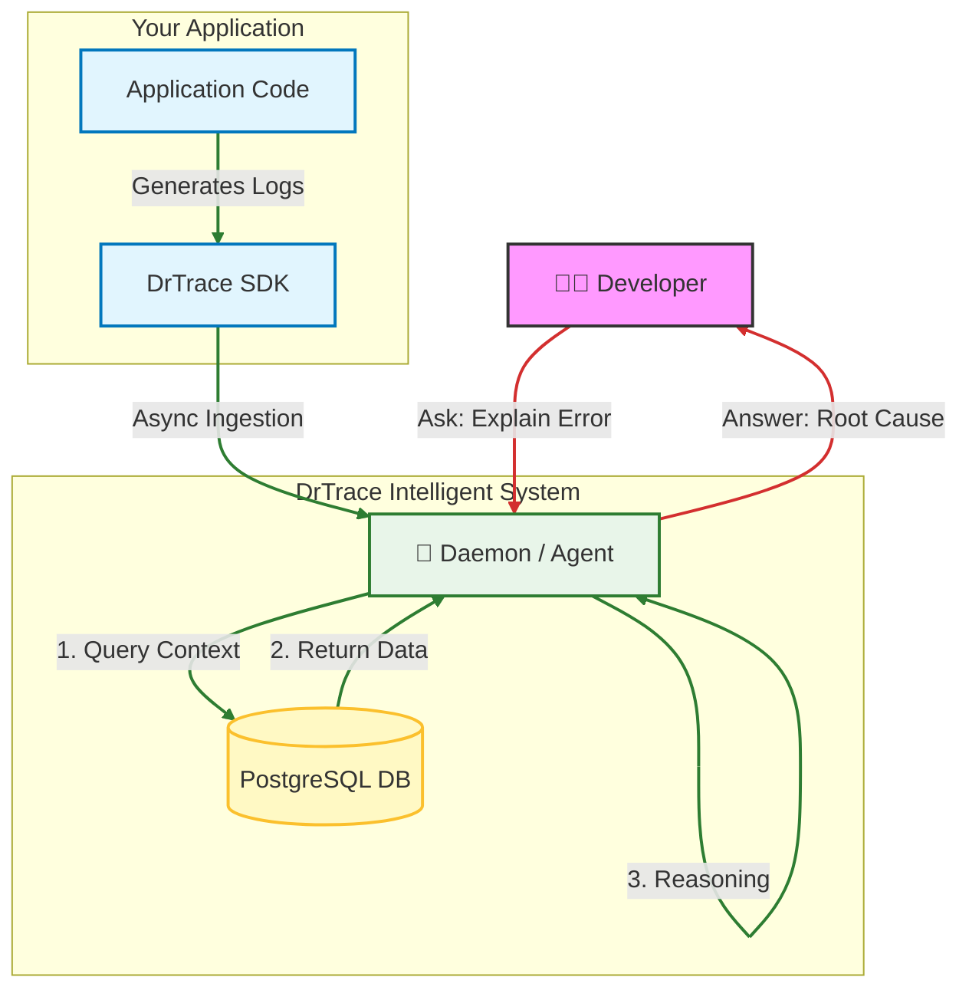

Have you ever spent hours manually sifting through thousands of log lines to find a single point of failure? Often the logs aren't sufficient to explain the issue, so you add more logging, rerun the application, and search again. That's frustrating and time-consuming, so I created DrTrace.

**DrTrace** (short for **Doctor Trace**) is an AI-first system that transforms raw logs into concise, actionable explanations—so you can spend time fixing problems, not searching for them.

# What is DrTrace?

DrTrace is more than a logging library. It combines structured logging, source-code context, and AI analysis into a single workflow that surfaces root causes and suggested fixes.

Once integrated into your application stack, you can ask DrTrace questions like "What caused the error between 09:00–10:00?" and receive a focused explanation with links to relevant code paths.

A typical DrTrace answer looks like this:

```
Q: Hey, I see a spike in errors around 10:15 AM. What happened?
A: Between 10:14:50 and 10:15:30, there were 150 timeout errors in the PaymentService module. This coincides with a surge in user requests due to a marketing campaign. The root cause appears to be an unhandled exception in the process_payment() function when the database connection pool is exhausted. Suggested fix: implement retry logic with exponential backoff and increase the pool size.
```

**Notes:** DrTrace is inspired by the [BMad-Method](https://github.com/bmad-code-org/BMAD-METHOD), which leverages AI to help developers debug complex systems more efficiently. The system is designed around an Agent core and exposes tools—log querying, context gathering, and similar utilities—to assist the Agent during investigations.

## Key benefits

- **Efficiency:** Replace manual searches with instant, structured explanations.
- **Context-aware:** Correlates logs with source code and execution context for deeper insights.
- **Low overhead:** Designed to add minimal runtime cost (targeting <1% CPU impact).
- **Cross-language support:** Works across polyglot stacks (Python, C++, etc.) using a unified schema.

## Architecture at a glance

The architecture is illustrated below:



and the process when using DrTrace looks like this:
1. Install DrTrace SDK in your application (Python/C++).
2. Start the DrTrace log server and API to collect logs.
3. Use the DrTrace `log-init` agent to scan your project and suggest how to integrate DrTrace into your codebase.
4. Use DrTrace `log-it` agent to add strategic log entries with context.
5. Run your application as usual; logs are sent to the DrTrace intelligence server.
6. Use DrTrace `log-analysis` agent to ask questions and get explanations about log patterns.

## Components

- **Client SDKs:** Python (3.8+) and C++ SDKs enrich logs with structured fields and source context.
- **Intelligence server:** A FastAPI-based service (default port 8001) handles indexing and AI reasoning.
- **Storage:** PostgreSQL stores structured logs and metadata for durable queries.

**Getting started**

First, you need to install the DrTrace via:

```bash
npm install drtrace
```

then run drtrace initialization command to set up your project:

```bash
npx drtrace init
```

then answer a few questions about your application:

```
🚀 DrTrace Project Initialization

==================================================

📋 Project Information:
✖ Project name … my-app
✖ Application ID … my-app

🔧 Technology Stack:
✔ Select language/runtime: › javascript

📡 DrTrace Daemon Configuration:
✔ Daemon URL … http://localhost:8001
✔ Enable DrTrace by default? … yes

🌍 Environments:
✔ Which environments to configure? › development

🤖 Agent Integration (Optional):
✔ Enable agent interface? … yes
✔ Select agent framework: › bmad
```

This creates a `_drtrace` folder with configuration and agents that help you instrument logging and analyze logs later.

Then pull the source from [GitHub](https://github.com/CaoDuyThanh/drtrace.git) and start the DrTrace server for logging:

```bash
docker-compose up -d
```

It will start PostgreSQL and the DrTrace API server on port 8001.

Then integrate DrTrace SDK into your application. For example, in Python with standard `logging` module:

```python
from drtrace_client import setup_logging

# Attach DrTrace to your existing logger
setup_logging(logger, application_id="my-app-id")
logger.info("This log is now AI-enriched")
```

Or if you are not sure how to integrate DrTrace into your codebase, you can use the `_drtrace/agents/log-init.md` agent to scan your project and suggest places to add logging:

Once you set up DrTrace logging, run your application as usual. Logs will be sent asynchronously to the DrTrace server.

When you notice an issue, use the `_drtrace/agents/log-analysis.md` agent to ask questions about log patterns:

```bash
drtrace analyze --question "What caused the spike in errors between 10:00 and 11:00?"
```

And that's it.

## Final thoughts

DrTrace aims to bridge the gap between raw data and true understanding by creating a workflow that helps AI agents and engineers extract useful system insights from logs. By automating correlation and providing concise explanations, DrTrace helps teams identify root causes faster and ship fixes with confidence.

## What's next?

DrTrace is still in early development and does not yet have enough context to produce fully accurate analyses. Accurate results require both source-code context and runtime traces, so I will work on an additional tool for context analysis. See you in the next post!

**Repo**: [DrTrace (GitHub)](https://github.com/CaoDuyThanh/drtrace).
